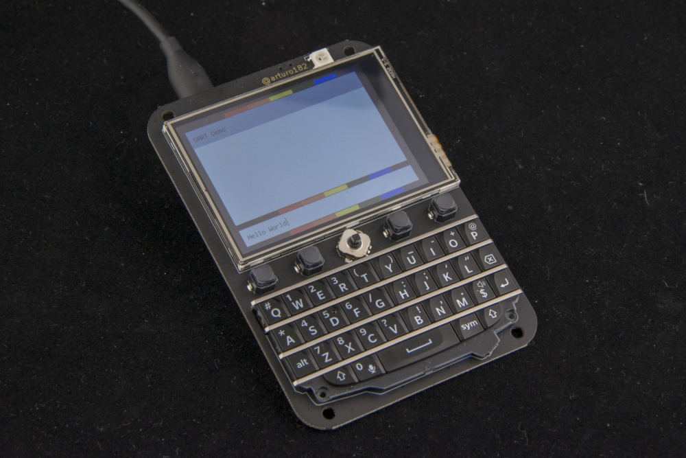

# The Keyboard FeatherWing

The Keyboard FeatherWing is an easy way to add a handheld Qwerty keyboard and a 2.6” color display (+ more) to your project! It fits well in your hands and is great for typing with your thumbs, early 2000s-style.

The FeatherWing itself does not contain an MCU/CPU/SoC that you can program; you will need a board compatible with the [Adafruit Feather System](https://learn.adafruit.com/adafruit-feather/feather-specification).

# Technical details
- 2.6” 320x240 16-bit color LCD with resistive touch screen
- QWERTY keyboard
- 5-way button
- 4 soft tactile buttons
- A Neopixel
- microSD connector
- Stemma QT/Qwiic connector
- On/Off switch
- Dual row sockets
- Four mounting holes
- GPIO solder jumpers

# Links

For more information visit https://kfw.solder.party/

You can find example code here: https://github.com/arturo182/keyboard_featherwing_sw

This board uses a ATSAMD20 chip as a i2c peripheral that can be polled to get the key FIFO, the firmware for the SAM can be found here: https://github.com/arturo182/bbq10kbd_i2c_sw
